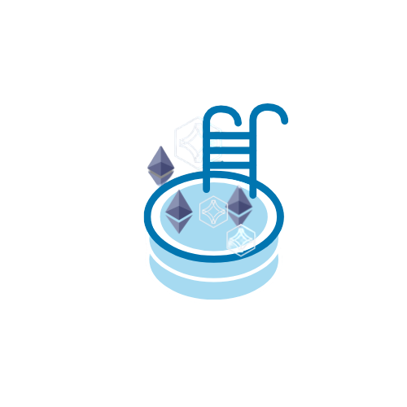

<!--
*** Thanks for checking out the Best-README-Template. If you have a suggestion
*** that would make this better, please fork the repo and create a pull request
*** or simply open an issue with the tag "enhancement".
*** Thanks again! Now go create something AMAZING! :D
-->

<!-- PROJECT SHIELDS -->
<!--
*** I'm using markdown "reference style" links for readability.
*** Reference links are enclosed in brackets [ ] instead of parentheses ( ).
*** See the bottom of this document for the declaration of the reference variables
*** for contributors-url, forks-url, etc. This is an optional, concise syntax you may use.
*** https://www.markdownguide.org/basic-syntax/#reference-style-links
-->

[![Contributors][contributors-shield]][contributors-url]
[![Forks][forks-shield]][forks-url]
[![Stargazers][stars-shield]][stars-url]
[![Issues][issues-shield]][issues-url]
[![MIT License][license-shield]][license-url]
[![LinkedIn][linkedin-shield]][linkedin-url]

<!-- PROJECT LOGO -->
<br />
<p align="center">
  

  <h3 align="center">ETH Pool</h3>

  <p align="center">
    A Pool that provides weekly rewards to the users.
    <br />
    <a href="https://github.com/vinivst/ethpool/#getting-started"><strong>Explore the docs »</strong></a>
    <br />
    <br />
    <a href="https://github.com/vinivst/ethpool/issues">Report Bug</a>
    ·
    <a href="https://github.com/vinivst/ethpool/issues">Request Feature</a>
  </p>
</p>

<!-- TABLE OF CONTENTS -->
<details open="open">
  <summary>Table of Contents</summary>
  <ol>
    <li>
      <a href="#about-the-project">About The Project</a>
      <ul>
        <li><a href="#built-with">Built With</a></li>
      </ul>
    </li>
    <li>
      <a href="#getting-started">Getting Started</a>
      <ul>
        <li><a href="#prerequisites">Prerequisites</a></li>
        <li><a href="#installation">Installation</a></li>
      </ul>
    </li>
    <li><a href="#usage">Usage</a></li>
    <li><a href="#tests">Tests</a></li>
    <li><a href="#roadmap">Roadmap</a></li>
    <li><a href="#contributing">Contributing</a></li>
    <li><a href="#license">License</a></li>
    <li><a href="#contact">Contact</a></li>
    <li><a href="#acknowledgements">Acknowledgements</a></li>
  </ol>
</details>

<!-- ABOUT THE PROJECT -->

## About The Project

![Product Name Screen Shot][product-screenshot]

Create a new ETH Pool and start your own pool allowing users to invest and earn weekly rewards. Things you can do:

- Create your own pool
- Deposit eth
- Withdraw eth
- Team members can add rewards manually
- Admin can manage team members (removing and adding new ones)
- Earn rewards!!!

A list of commonly used resources that I find helpful are listed in the acknowledgements.

### Built With

- [Solidity](https://soliditylang.org/)
- [React](https://reactjs.org/)
- [Reactstrap](https://reactstrap.github.io/)
- [Truffle](https://www.trufflesuite.com/)
- [Web3](https://web3js.readthedocs.io/)
- [Metamask](https://metamask.io/)
- [OpenZeppelin](https://openzeppelin.com/)

<!-- GETTING STARTED -->

## Getting Started

In the following sections you will learn how to clone this repo and get it up and running in no time.

### Prerequisites

You need to have npm installed.

- Download and install node, which already comes with npm:
  - [Download Node](https://nodejs.org/en/download/)

### Installation

1. Clone the repo
   ```sh
   git clone https://github.com/vinivst/ethpool.git
   ```
2. Install NPM packages in project ("backend")
   ```sh
   npm install
   ```
3. Install packages in client
   ```sh
   cd client
   yarn
   ```
4. Register a new account in [Infura](https://infura.io/) and create a new project to get your rinkeby key at
   https://infura.io/dashboard/ethereum

5. Create a .env file at root path (you can use .env.example as a pattern)

6. Create and save inside the .env the following:

   1. The MNEMONIC (12 words seed phrase from your wallet)
   2. INFURA_KEY (that you got from step 3)
   3. ETHERSCAN_KEY (if you want to verify your contract on etherscan, see https://github.com/rkalis/truffle-plugin-verify for more info)

7. Deploy your smart contracts
   ```sh
   truffle migrate --network rinkeby
   ```
8. Change to client directory and run react
   ```sh
   cd client
   yarn start
   ```
9. Enjoy your new ETH Pool! :smile:

<!-- USAGE EXAMPLES -->

## Usage

1. Users can deposit eth using the Deposit card (green one)

2. Then user can withdraw eth using the Withdraw card (black one)
3. Team can add rewards to the Reward Pool using the Deposit to Reward Pool card (gray one, only visible for team members)
4. Admin can manage the team members, removing and adding new ones on the last two black cards (only visible for admin)

<!-- TESTS -->

## Tests

You can see all the tests inside the test folder. The tests were all made using [Truffle Tests](https://trufflesuite.com/docs/truffle/testing/writing-tests-in-javascript.html) and Web3 (that are really running [Mocha](https://mochajs.org/) and [Chai](https://chaijs.com/) behind the scenes). To run the tests simply use:

```sh
truffle test
```

<!-- ROADMAP -->

## Roadmap

See the [open issues](https://github.com/vinivst/ethpool/issues) for a list of proposed features (and known issues).

<!-- CONTRIBUTING -->

## Contributing

Contributions are what make the open source community such an amazing place to be learn, inspire, and create. Any contributions you make are **greatly appreciated**.

1. Fork the Project
2. Create your Feature Branch (`git checkout -b feature/AmazingFeature`)
3. Commit your Changes (`git commit -m 'Add some AmazingFeature'`)
4. Push to the Branch (`git push origin feature/AmazingFeature`)
5. Open a Pull Request

<!-- LICENSE -->

## License

Distributed under the MIT License. See `LICENSE` for more information.

<!-- CONTACT -->

## Contact

Vinicius Santiago - [Email](mailto:vinicius.santiago@gmail.com)

Project Link: [https://github.com/vinivst/ethpool](https://github.com/vinivst/ethpool)

<!-- ACKNOWLEDGEMENTS -->

## Acknowledgements

- [GitHub Emoji Cheat Sheet](https://www.webpagefx.com/tools/emoji-cheat-sheet)
- [Best-README-Template](https://github.com/othneildrew/Best-README-Template)
- [Choose an Open Source License](https://choosealicense.com)

<!-- MARKDOWN LINKS & IMAGES -->
<!-- https://www.markdownguide.org/basic-syntax/#reference-style-links -->

[contributors-shield]: https://img.shields.io/github/contributors/vinivst/ethpool.svg?style=for-the-badge
[contributors-url]: https://github.com/vinivst/ethpool/graphs/contributors
[forks-shield]: https://img.shields.io/github/forks/vinivst/ethpool.svg?style=for-the-badge
[forks-url]: https://github.com/vinivst/ethpool/network/members
[stars-shield]: https://img.shields.io/github/stars/vinivst/ethpool.svg?style=for-the-badge
[stars-url]: https://github.com/vinivst/ethpool/stargazers
[issues-shield]: https://img.shields.io/github/issues/vinivst/ethpool.svg?style=for-the-badge
[issues-url]: https://github.com/vinivst/ethpool/issues
[license-shield]: https://img.shields.io/github/license/vinivst/ethpool.svg?style=for-the-badge
[license-url]: https://github.com/vinivst/ethpool/blob/master/LICENSE.txt
[linkedin-shield]: https://img.shields.io/badge/-LinkedIn-black.svg?style=for-the-badge&logo=linkedin&colorB=555
[linkedin-url]: https://www.linkedin.com/in/vinivst/
[product-screenshot]: ./images/screenshot.PNG
